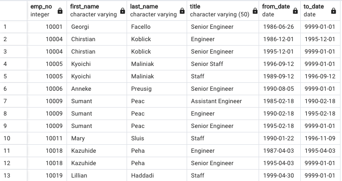
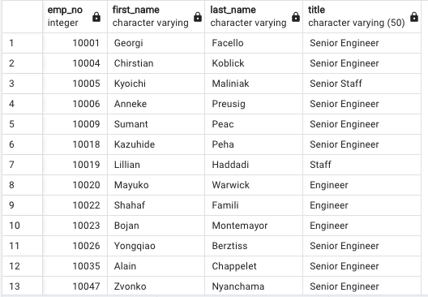
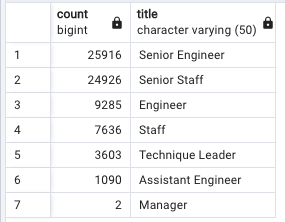
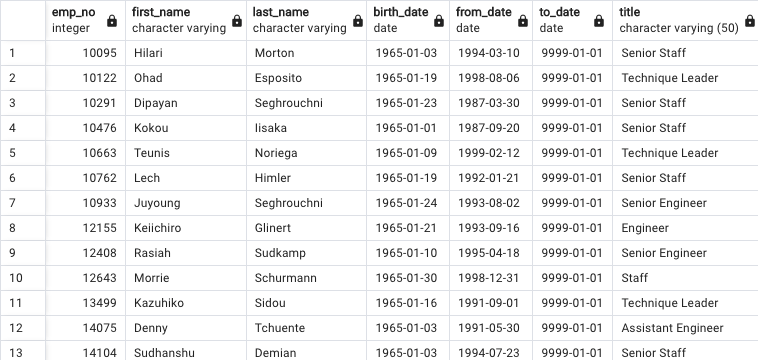
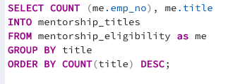
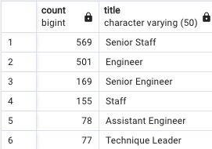
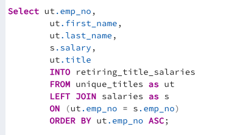
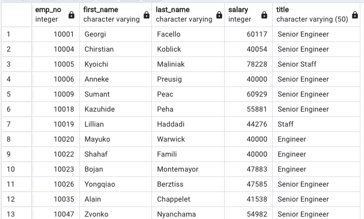

# Pewlett Hackard Analysis 

Tyrone Fraley 
UC Berkley Extension 
August 31, 2022 

  

## Overview 

Working at Pewlett Hackard in this project I was tasked to assist Bobby (HR analyst) in researching employees. Our purpose was to figure out who will be retiring in the coming years and how many positions will need to be backfilled. In addition to figuring out how many positions will need to be backfilled and who will be retiring in the coming years. Bobby and I were tasked to list all employees who would be eligible to participate in a mentorship program. Which could compliment Pewlett Hackard's future needs to backfill with possibly well vetted internal candidates. The final task in this process would be fore Bobby and I to prepare Bobby's manager for the "silver tsunami" which correlates itself within the employees who are reaching retirement age. We first gathered company data through six csv files which we organized through the use of ERD to determine primary and foreign keys in the data sets. We then used ERD as a graphical reference throughout the study. Finally, all of the csv files were uploaded into pgAdmin 4, organized, and analyzed by using SQL.

### Results: 

When conducting our analysis we initially started by gathering the number of retiring employees. Using SQL queries we amalgamated the data into a Retirement Titles Table ("retiring_emp_title"). The employees on this list were born between Jan 1, 2951 and Dec 31, 1955. the *DESTINCT ON* function turned out to be usefull during this analysis, because it allowed us to create a table that inclcuded the employees' current title. Further in our script we included the count (*COUNT()*) when creating a table that would hold an amount of retirement-age employees listed by their job title. 

 
Retiring Titles 
  * The Retiring Titles table allowed for us to find each employee expecting to retire in the comin gyears. 90,398 employees were born between 1952 and 1955. 
  * *Select Count* was used to discover the amount of employees ready to retire. 
    *SELECT COUNT(first_name) 
     FROM employees 
     WHERE (birth_date BETWEEN '1952-01-01' AND '1955-12-31') 
     AND (hire_date BETWEEN '1985-01-01' AND '1988-12-31');
 

  

 
 

Unique Titles 
    * Albeit, the Retiring Titles table was a success in it's own right. The data was skewed so Bobby and I created the Unique Titles table which left out employees that have already left the company. Our final amount of employees currently with the company who were soon to retire were 72,458. 
    * To remove the employees we used WHERE to_date = ('9999-01-01').

 

  

 
 

Retiring Titles Count 
    * The table below shows the amount of employees close to retirement by title. 
    * Senior Engineer had the highest count of employees ready to retire (25,916).

 

  

 
 

Mentorship Eligibility 
    * The final table Bobby and I created (Mentorship Eligibility) gave us a list of employees ready for mentorship. 
    * By using SELECT COUNT we did discover that only 1,549 employees made the list.

  

 
 
##Summary: 
Pewlett Hackard will need to fill 72,458 roles in the comming years to compensate for retiring employees. Considering that many of the employees wouldn't quit all at once, albeit they are all over the age of 65yrs old.  Considering, the amount of employees that are ready to retire could hold valuable experience. Many could be vetted and offered packages to stay on board with the company as mentors to the next wave of employees meant to backfill the roles for the employees who are ready to retire. Such packages could hold work from home options to incentivise the soon to retire employees. 

Contributions to Research 

 
In conclusion, further research is needed to truly understand the impact the "Silver Tsunami" may have on Pewlett Hackard. Below I have included two tables that could offer benefit to the company during future research efforts. 
 
##Summary: 
Pewlett Hackard will need to fill 72,458 roles in the comming years to compensate for retiring employees. Considering that many of the employees wouldn't quit all at once, albeit they are all over the age of 65yrs old.  Considering, the amount of employees that are ready to retire could hold valuable experience. Many could be vetted and offered packages to stay on board with the company as mentors to the next wave of employees meant to backfill the roles for the employees who are ready to retire. Such packages could hold work from home options to incentivise the soon to retire employees. 

Contributions to Research 

 
In conclusion, further research is needed to truly understand the impact the "Silver Tsunami" may have on Pewlett Hackard. Below I have included two tables that could offer benefit to the company during future research efforts. 
 

Mentorship Titles 
    * The Mentorship Titles table shows all current employees with eligibility for mentorship. Each title has the count of employees within that role. 
    * Note: Senior Engineer greatly falls short with the amount of qualified mentees. This may be an area of interest considering 25,916 Senior Engineers will be retiring.

  

  

 

Retiring Titles Salaries 
    * To better understand the salaries of the current employees ready to retire. A new table was created. 
    * The purpose of this table is to be prepared if compensation will be required to incentivise those ready to retire to stay with the company and mentor the mentees. 

  

  

